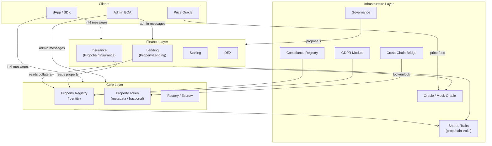
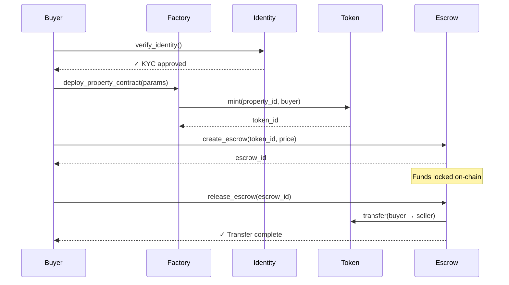
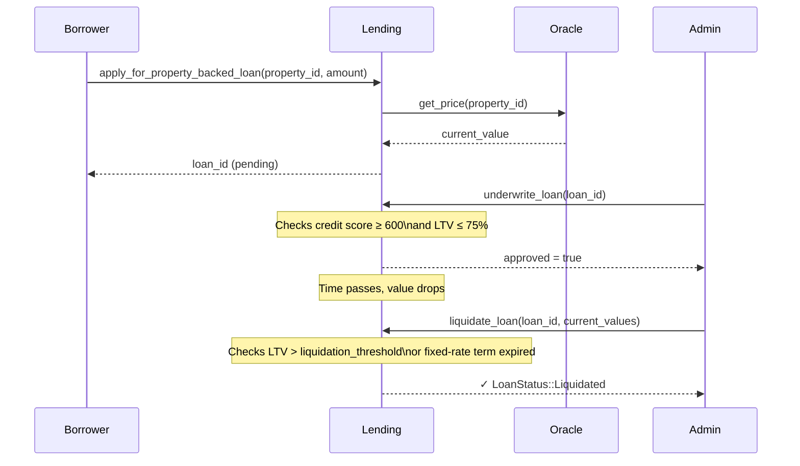
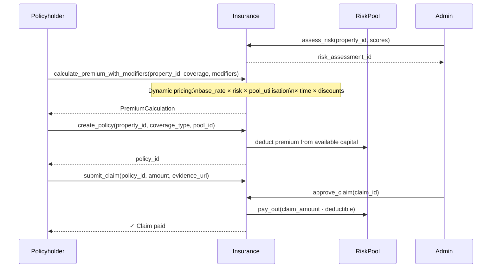
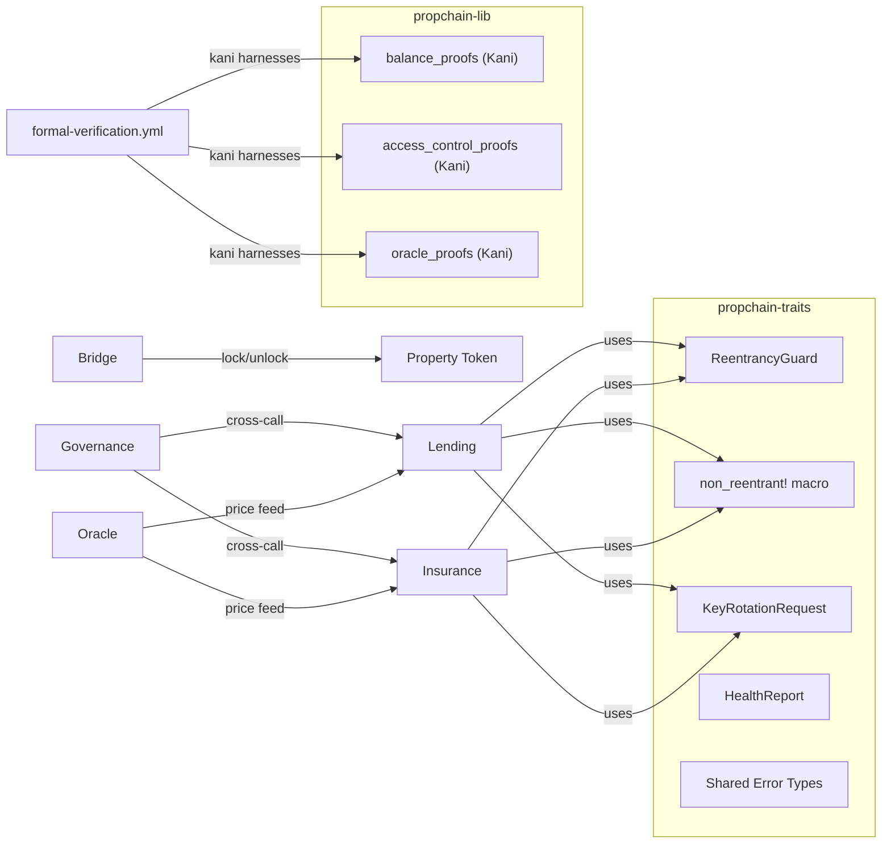
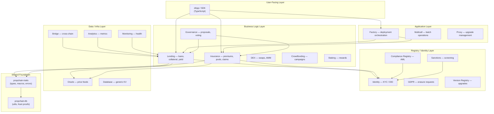

# PropChain Smart Contract Architecture

> One-stop overview of the contract system.  
> For deep-dives see the per-contract READMEs under `contracts/` and the
> supplementary docs under `docs/`.

---

## Table of Contents

1. [System Overview](#1-system-overview)
2. [Contract Map](#2-contract-map)
3. [Component Interaction Diagrams](#3-component-interaction-diagrams)
   - [Property Purchase Flow](#31-property-purchase-flow)
   - [Lending & Liquidation Flow](#32-lending--liquidation-flow)
   - [Insurance Premium & Claims Flow](#33-insurance-premium--claims-flow)
   - [Cross-Contract Data Flow](#34-cross-contract-data-flow)
4. [Layer Breakdown](#4-layer-breakdown)
5. [Key Design Principles](#5-key-design-principles)
6. [Security Model](#6-security-model)
7. [Further Reading](#7-further-reading)

---

## 1. System Overview

PropChain is a modular set of ink! (Substrate/Polkadot) smart contracts that
together implement decentralised real-estate infrastructure: tokenisation,
lending, insurance, governance, compliance, and cross-chain bridging.

---

## 2. Contract Map

| Contract | Crate | Primary Responsibility |
|----------|-------|----------------------|
| `identity` | `propchain-identity` | On-chain KYC / DID registry |
| `metadata` | `propchain-metadata` | Property metadata & IPFS pinning |
| `fractional` | `propchain-fractional` | Fractional ownership tokens |
| `ipfs-metadata` | `propchain-ipfs-metadata` | IPFS CID storage helpers |
| `lending` | `propchain-lending` | Collateral, pools, loans, liquidations, yield |
| `insurance` | `propchain-insurance` | Dynamic premiums, risk pools, claims |
| `staking` | `propchain-staking` | Token staking & rewards |
| `dex` | `propchain-dex` | On-chain swap / AMM |
| `oracle` | `propchain-oracle` | Price feed aggregation |
| `mock-oracle` | `propchain-mock-oracle` | Deterministic test oracle |
| `bridge` | `propchain-bridge` | Cross-chain asset bridge |
| `governance` | `propchain-governance` | Proposals & voting |
| `compliance_registry` | `propchain-compliance-registry` | AML/KYC compliance records |
| `gdpr` | `propchain-gdpr` | GDPR data erasure requests |
| `sanctions` | `propchain-sanctions` | OFAC/sanctions screening |
| `factory` | `propchain-factory` | Contract deployment factory |
| `proxy` | `propchain-proxy` | Upgradeable proxy pattern |
| `analytics` | `propchain-analytics` | On-chain metrics accumulation |
| `monitoring` | `propchain-monitoring` | Health-check aggregation |
| `version-registry` | `propchain-version-registry` | Contract version tracking |
| `database` | `propchain-database` | Generic key-value store |
| `multicall` | `propchain-multicall` | Batch message dispatcher |
| `prediction-market` | `propchain-prediction-market` | Property price prediction markets |
| `crowdfunding` | `propchain-crowdfunding` | Property crowdfunding campaigns |
| `fees` | `propchain-fees` | Platform fee configuration |
| `property-management` | `propchain-property-management` | Ongoing property management |
| `traits` | `propchain-traits` | Shared types, errors, macros |
| `lib` | `propchain-lib` | Shared utilities & Kani proofs |

---

## 3. Component Interaction Diagrams

### 3.1 Property Purchase Flow

### 3.2 Lending & Liquidation Flow

### 3.3 Insurance Premium & Claims Flow

### 3.4 Cross-Contract Data Flow

---

## 4. Layer Breakdown

---

## 5. Key Design Principles

**Reentrancy protection** — every state-mutating message that calls back
into unknown code is wrapped with the `propchain_traits::non_reentrant!`
macro, which checks and sets a `ReentrancyGuard` flag stored in contract
storage.

**Two-step admin rotation** — admin transfers use a time-locked two-step
flow (`request_admin_rotation` / `confirm_admin_rotation`) with a
configurable cooldown and expiry window, preventing key-compromise attacks.

**Saturating arithmetic** — all numeric operations use Rust's
`saturating_add` / `saturating_sub` / `saturating_mul` to prevent overflow
panics, which would abort the entire extrinsic on-chain.

**Basis-point precision** — rates, multipliers, and fees are stored and
computed in basis points (1 bp = 0.01 %) using integer arithmetic.
This avoids floating-point non-determinism while providing 0.01 % precision.

**Formal verification** — balance conservation, access control, and oracle
freshness are proved by Kani model-checker harnesses in `contracts/lib`
and run on every PR via `.github/workflows/formal-verification.yml`.

**Modular crates** — each contract is its own Cargo workspace member.
Shared types and macros live in `contracts/traits` and `contracts/lib`,
which are pure-Rust crates (no `#[ink::contract]`) for easy unit-testing
and inclusion in Kani proofs.

---

## 6. Security Model

| Threat | Mitigation |
|--------|-----------|
| Reentrancy | `non_reentrant!` macro in lending, insurance, bridge |
| Admin key compromise | Two-step time-locked rotation with expiry |
| Integer overflow | Saturating arithmetic throughout |
| Oracle manipulation | Staleness bound proved by Kani; mock oracle in tests |
| Unauthorised calls | `caller != self.admin` guards on all privileged messages |
| Dependency vulnerabilities | `cargo-deny` + `cargo-audit` in nightly CI |
| Logic mutations | `cargo-mutants` gate in nightly CI for lending, bridge, oracle |
| Formal invariants | Kani balance/access/oracle proofs on every PR |

See [`SECURITY.md`](./SECURITY.md) and [`security-audit/`](./security-audit/)
for the full threat model and third-party audit reports.

---

## 7. Further Reading

| Resource | Path |
|----------|------|
| Lending contract | [`contracts/lending/README.md`](./contracts/lending/README.md) |
| Insurance premium calculation | [`contracts/insurance/DYNAMIC_PREMIUM_CALCULATION.md`](./contracts/insurance/DYNAMIC_PREMIUM_CALCULATION.md) |
| Insurance implementation summary | [`contracts/insurance/IMPLEMENTATION_SUMMARY.md`](./contracts/insurance/IMPLEMENTATION_SUMMARY.md) |
| Insurance penalty drift resolution | [`docs/penalty_drift.md`](./docs/penalty_drift.md) |
| Bridge liquidity pools | [`contracts/bridge/LIQUIDITY_POOLS.md`](./contracts/bridge/LIQUIDITY_POOLS.md) |
| Factory deployment guide | [`contracts/factory/DEPLOYMENT_GUIDE.md`](./contracts/factory/DEPLOYMENT_GUIDE.md) |
| Oracle encryption | [`contracts/oracle/ENCRYPTION.md`](./contracts/oracle/ENCRYPTION.md) |
| Proxy upgrade governance | [`docs/proxy_upgrade_governance.md`](./docs/proxy_upgrade_governance.md) |
| Dependency unification | [`docs/dependency_and_prelude_unification.md`](./docs/dependency_and_prelude_unification.md) |
| Clippy triage guide | [`docs/clippy_triage_guide.md`](./docs/clippy_triage_guide.md) |
| Development setup | [`DEVELOPMENT.md`](./DEVELOPMENT.md) |
| Contributing guide | [`CONTRIBUTING.md`](./CONTRIBUTING.md) |
| Security policy | [`SECURITY.md`](./SECURITY.md) |
| Audit log | [`AUDIT_LOG.md`](./AUDIT_LOG.md) |
